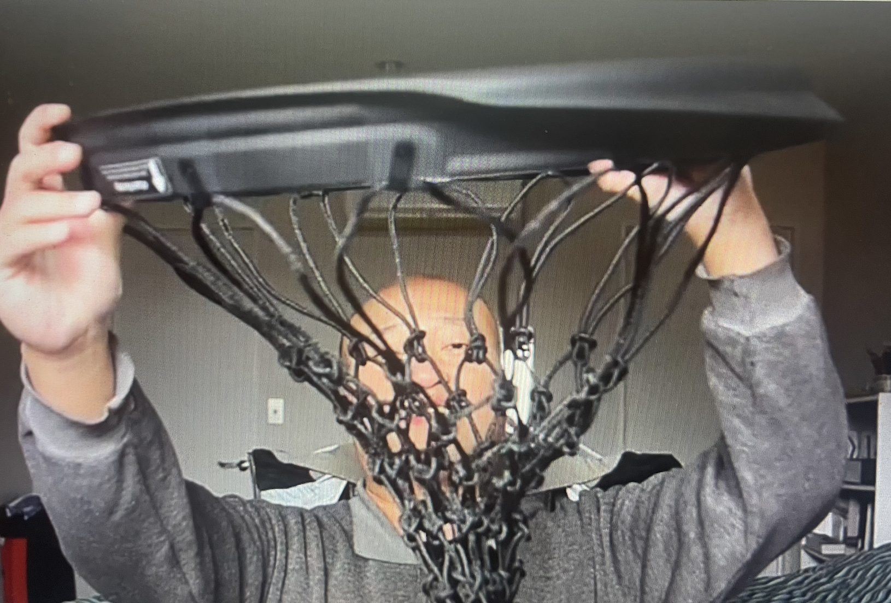

# ECE16 HW7 Report

Prepared by: Chuqiao Lu, Sidath Wijesinghe, and Chenhao Zhu

Date: 06/08/2023

The **Overall Objective** of this lab is to understand and use iteration in engineering practice. Iteration is the core of designing and building and testing is key for effective iterations. We need to continue to build our prototype to achieve our customer’s needs. Refining our design, recieving feedback, and testing the system to identify whether the system we are building meets the intended functionality will be the process of this lab.

---

**Challenge 1** involves the development of the model as the project evolves through each iteration. Each iteration will show the current state of the prototype, what features we would want to observe the customer using, our observations and the customer's feedback, and how we will iterate based on the findings.  

Iteration 1: Our first iteration was the initial prototype that was presented for HW6. As shown in Figure 1 below, the basic function of this prototype is basically a rim cover that goes over the basketball rim that also is attached with an electronics box. This is essentially what the customer does. He places the prototype onto the rim, score some points, and view the OLED display that is viewable on the side of the electronics box. This electronics box has the ultrasound sensors, the OLED display, and the breadboard. To implement this, connect the rim cover pieces (pink and white) together as it is designed to be a plug and play system. Similarly to the plug and play system, attach the electronics plate (green) onto the system and the electronics box (blue). 

As usual in every prototype, there would be some issues. For instance, the ultrasound does not detect properly and the electronics box would seem to cause an issue. No matter what placement the battery would be in, it would not fit. The depth of the electronics box was not enough. Additionally, the plan was to have the electronics plate and box be screwed on, however the placement of the holes were an issue where it would interfere with the actually basketball rim.

**Figure 1: This figure shows the initial prototype with the ultrasound system.**
  

Iteration 2: Based on the findings from the first iteration, we decided to create a second iteration. The second itteration of the project was where we switched up the idea completely. Instead of using ultrasound sensors, we would switch to a laser diode and photodiodes system. Although the same issue would occur where the net could block the laser, we could fix it by adjusting the net or by cutting some portion of the net where it would be necessary. We would also switch the battery from a 9V to a combined of 6V using 2 CR2032 Lithium Batteries. This system would be better as it allows the electronics box to be significanty smaller.

As shown in Figure 2 below, in developing the laser diode and photodiode, we needed to develop something that would hold the lasers since the sensors could be placed within the electronics box. Additionally, this attachment "hooks" onto the rim cover. Note that the attachment in Figure 2 does not have the "hooks" mentioned on the inner side of the rim cover. Due to time constraints, 3D printing another rim cover piece would not be ideal. We artifically created that hook but using a wirte and a screw that could be used for tightening the hook. The attachment was inspired through the idea of arcade machines. They most likely use infrared sensors in the same place as Figure 3 below. However the laser diode would be more effective than infrared outside since it would not affected by the outside noise too much. 

**Figure 2: This figure shows the initial design of the second prototype. This new design involves the development of an attachment, which holds the laser diode.**
  

**Figure 3: This figure shows the attachment being on the rim which would eventually hold the laser diode.**
  

As shown in Figure 4 below, the wiring is shown underneath. This allows for the wires to be discrete and not causes issues, especially when using jumper wires. Additionally since space was used up to hold the laser diodes outside of the electronics box, this means that the size of the electronics box can be reduced. In the first iteration, we considered expanding the electronics box and added a hole pattern where the ultrasound sensors could be placed where they need to be, however, increasing the size of the box would be unnecessary and the 3D printer would take too long. As shown in Figure 5 below, by the new system, we were able to move some of the electronics around to be able to significanly reduce the size of the electronics box. This would help the final design and the 3D print overall. The overall design is shown in Figures 6.

**Figure 4: This figure shows the bottom view of the rim cover with the attachment, showing how the wiring of the laser diodes would be connected to the electronics box.**
  

**Figure 5: This figure shows the new version of the placement of the electronics, allowing the box to be significanly reduced.**
  

**Figure 6: This figure shows the perspective view of the second prototype with everything attached on.**
  

Iteration 3: After remodeling the entire project, we were able to create a 3D model of the new system and started 3D printing the relavent parts, which are the electronics plate and the electronics box. We have altered the physicality of the 3D parts using drills, soldering, adjusting the wiring, and also switched the battery back to the original. Additionally, we removed the attachment and used a clip-type attachment from a mini screwdriver as shown below in Figure 6. This iteration is what becomes our final project design, which will be described and shown in the Challenge 2 and 3 section.

**Figure 7: This figure shows the removal of the attachment and shows how one laser is being used.**
 

---

**Challenge 2** is testing and characterizing our current system or iteration before having the customer use it. Not letting the customer using the product is important as it helps to inform how good the system performs and whether it is even ready for someone to use it. 

Iteration 1:

The code relavent to this iteration is shown in the count_score_2_sensor.ino file in the Code folder. The main portion of the program is where the loop runs continuously until the Arduino loses power. The Arduino checks to see if a shot has been made. The algorithm checks if a shot has been made by checking if the distance from the ultrasonic distance sensor to the next closest object is under a certain threshold distance that we set.

In terms of testing purposes, we did not have a stable rim cover since it was not glued so we dropped the ball in a vertical manner so that the rim cover would not get hit. If the rim cover gets hit, the system would start to break apart since the during that iteration, tape was the only thing that was keeping the system together. Additionally, the entirely of the system is too large. This system is not ideal since for the real world, we would be throwing this product towards the hoops. Once it is thrown, having a large electronics box would not be a good idea, plus the fact that if the hoops misses, the entire system would break apart. Additionally, if the hoop makes it onto the rim, the quick momentum changes will affect the ultrasound sensors. We tried testing various distance thresholds from the ultrasound sensors and we can see below in Figure 7, 8, and 9, the various Confusion Matrix that we collected throughout the data collection process.

**Figure 8: This figure shows the removal of the attachment and shows how one laser is being used.**
  

**Figure 9: This figure shows the removal of the attachment and shows how one laser is being used.**
  

**Figure 10: This figure shows the removal of the attachment and shows how one laser is being used.**
  

Iteration 2:

The code relavent to this iteration is shown in the LaserDetectingSystem.ino file in the Code folder. The main portion of the program is where the loop runs continuously until the Arduino loses power. The Arduino checks to see if a shot has been made. The algorithm checks if a shot has been made by checking if the laser from the laser diode has been blocked. Since there are certain values for when the photo diode is sensing light intensity, we check when there is no light intensity, since the ball would be blocking it. 

In terms of testing purposes, we could not test it properly since the 6V that we were powering the entire system was not "stable". Using 2 CR2032 Lithium Batteries was not a good idea especially for the laser diodes since they were dying out in a quick manner. We looked at the data sheet and they required 5V. However, during the time that we tested the counting system, we would throw the ball sideways, underneath the hoop straight up, and other wierd trajectories by manipulating the movement of the ball ourselves. The system would count and buzz properly, however the OLED display would sometimes turn off. We were considering that the fact could be that the batteries were the issue.

Iteration 3:

The code relavent to this iteration is shown in the both the LaserDetectingSystem.ino file and the count_score.ino file in the Code folder. The code is basically the same as in the Iteration 2 section, however, in the count_score.ino file, uses one sensor. The reason is that using two sensors will work in all situations that we could think off, however, it will not detect the shots that are too fast. We would have to somewhat guide the ball into the net and pushing the ball off the rim and into the net is still too fast. We would need a faster processor to fix this or get a line laser diode. This line laser diode would shine a line rather than a point. This line would help increase the distance between the two sensors so that when the ball is dropped the time for the first sensor and the second sensor to get blocked would be longer, meaning that with our current MCU, it would be able to detect the shot.

In terms of testing purposes, we split up the testing in two sections. The testing were the same where we used a single or two sensors. The testing would be normal shots, "dunking" shots where we throw the ball as fast as we can straight down the net, and "weird" shots, which include shooting straight up from below the net and sideways. We tried testing these various tests on the photo diode sensors and we can see below in Figure 10 and 11 the various Confusion Matrix that we collected throughout the data collection process.

There are some flaws with this system as having an attachment would be not be stable and the system should be a single collective piece. Another issue to fix would be the material. The current material would not be strong enough to actually use a basketball. Another issue would be the idea itself that the customer wants. For example, throwing the hoop that holds the electronics and putting the OLED display to be shown in front is not ideal. More in-depth explanation is shown towards the end of Challenge 3.

**Figure 11: This figure shows the removal of the attachment and shows how one laser is being used.**
  

**Figure 12: This figure shows the removal of the attachment and shows how one laser is being used.**
  

---

**Challenge 3** is building and documenting the final prototype. As mentioned in Challenge 1, we went a different route in designing the prototype. The way our final prototype works is that instead of using ultrasound sensors, we switched to a laser diode and photodiodes system. This system works and satisfies our customer since the rim cover can be taken off or on the rim at anytime and it counts the score as needed. There is a buzzer that makes a sound once the user scored a point and you can reset the score by turning the switch off and then on. The system works where there is a rim cover that holds onto two things: electronic box and a small clip that holes the laser diode. The laser diode are put in a manner where the laser would be right across from the elecronics box. This diode will shoot a laser towards the electronics box and there will be some photodiodes to sense the light intensities. If the laser is blocked by an object, meaning that there is no light on the sensor, then that means the object has made through it through the net and the score needs to be updated by one.

This system could help reduce the overall size of the system through the redesign of the circuit and because the system uses an attachment to hold the laser diode, there will be less space used inside of the electronic box. The issue might come where the net might block the sensors, but the algorithm will only increase the score whether the first laser is blocked, then the second laser is blocked afterwards. Addionally, after a point has been made, there will be a delay, so that the it would not detect anything else for a second or two seconds, in case of noise. 

We have made some changes from iteration 2. One was 3D printing two parts, which are the reduced size electronics plate (gray) and the electronics box (black). Additonally, we removed the original attachment we created and used a screwdriver clip as shown in Figure 7. We have made some physical changes to the box using a drill and have made changes with the circuitry. Eventually we will add velcro to make the system truely a "plug-and-play" system. This means that the system would contain 2 parts: the rim cover which contains the hooks to hold the net and also holds the laser diode, and then the electronic box. As shown below in Figre 13, the entire system, which was describe above, can be shown. The laser shoots out in somewhat of a rectangle manner at the two sensors.

**Figure 13: This figure shows the perspective view of the final prototype with everything attached on.**
  

Overall, there are a lot of flaws within this system as mentioned above in Challenge 2. However, we believe that the laser diode and photo diode system is ideal itself. We were considering to switch to infrared because of the system that arcade basketball games most likely use, however, since this system would be outside and most likely during the day, there would be a lot of noise outside. If we were to improve this system, we would need to remove the attachment. One main reason is that this system is meant to be one collective part. To fix this issue, we would have add a hole in the rim cover itself to hold the laser diode. The wiring could be similar to Figure 4 or it could a tunnel inside the rim cover so no wires would be seen. Another issue to fix would be the material and the overhang of the rim cover. We would use a strong plastic and also the overhang would be much longer so that there would be space to incorporate both laser diodes at different heights. This could be shown below in Figure 14. A third issue would be stability. The current system would not be ideal since if the ball hits the rim, it might change the angle of the laser diode, which would mean that the laser would not be on the photo diode, causing errors in the score. Although we can manually allign the laser diodes and fix any allignment issues, that would be not be ideal for the customer. Another issue would be the idea itself that the customer wants. The hoop attachment and the electronics somewhat conflict with each other. For example, throwing the hoop that holds the electronics is not a good idea and the fact that OLED display needs to be shown would be difficult. Having a large display means the system needs to be large and to protect it, we need clear material that can be sturdy and see through.

**Figure 14: This figure shows the long overhang where the laser diodes could be incorporated into the system without using an attachment**
  

